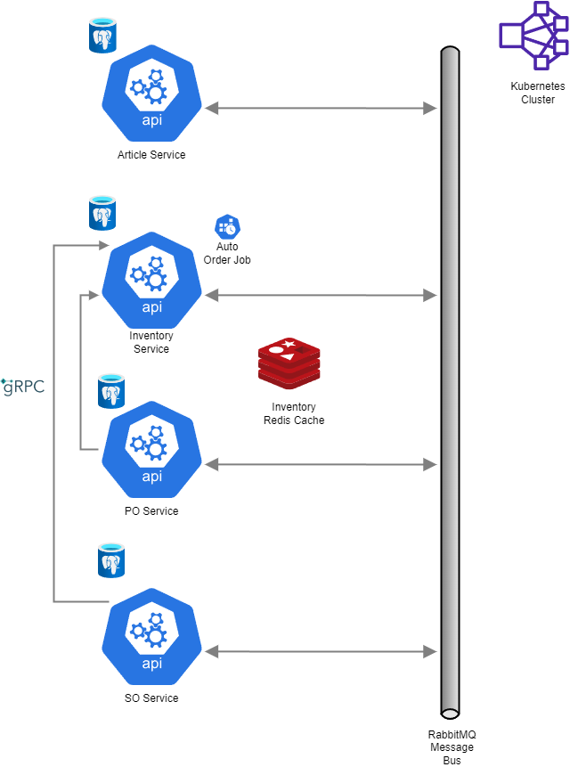

#MiniERP

##Table of content

##Project Description

MiniERP is an ever-evolving back-end for a fictional ERP system. It stems from an attempt to reconcile my current job as an ERP integration developper with a desire to explore Software Architecture and Distributed Systems. Having been in contact with how ERPs can be complicated, with multiple related components, I felt that it was the perfect canvas to try new technologies. Just add new components! 

The base is composed of 4 modules : 
  Product Service : Create new product
  Inventory Service : manage stocks
  Purchase Order service : Create PO to refill stocks
  Sales Order Service : Create SO to, well, sell products!
  
 Those four modules allowed me to explore service decoupling via a Message Bus, for which the architecture was the hardest part : how can I make these services autonomous, while still being interdependant? SOs and POs need to validate the inventory before being created. A cache was used from which they have read access, while write access is given to the Inventory service. RPC call is made in case the cache is unavailable.
 
 All in all, this weas a very fun project, that allowed me to get acquainted with modern Distribute System technologies and patterns. This is obviously not a real-file application, but more an exploration into something bigger.I plan on returning back to it and make it grow with time.
 
 ##Architecture
 

Services are ASP.NET WEb API with the usual CRUD operations, and are hosted as pods on a single K8 cluster (for money reason). An NGINX controller serves as a reverse proxy, routing HTTPS from the outside to HTTP inside the cluser. They all have a POSTGRESQL database, for which they are the sole responsible. A Redis cache is used for fast access of inventories, with the Inventory service having write access and the SO and PO service having read access. Retry strategies are implemented, and these services can fall back to gRPC call to the inventory service in case the cache is unavailable. A RabbitMQ message bus is setup for messaging between services, mostly for the Inventory service to subscribe to Order-related messages and update the inventory accordingly.

In each service, MediatR is used with CQRS to handle requests. 
FluentValidation is used for validating item. 
Polly is used for cache and gRPC retry strategies.

##Technologies

Kubernetes/Docker
.NET 6
Redis
RabbitMQ
PosgreSQL
gRPC
